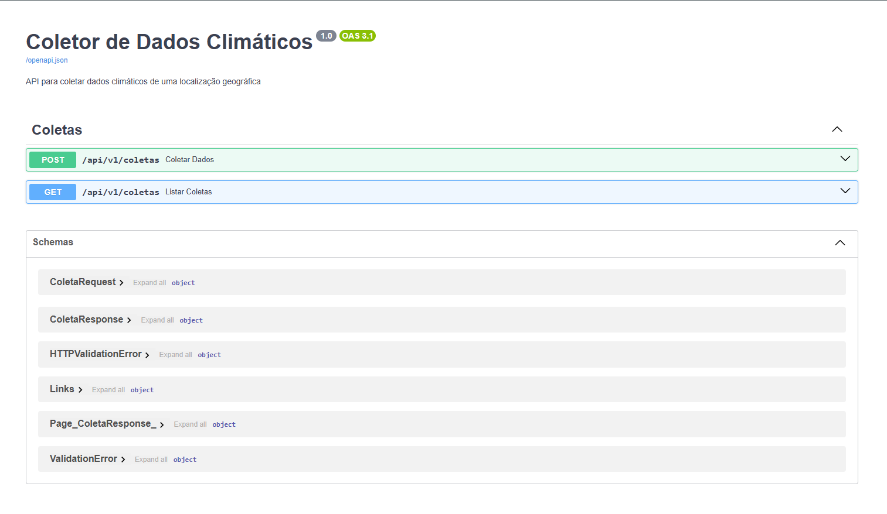

# Coletor Service

API para coletar dados climáticos de uma localização geográfica.

## Descrição

Esta API permite a coleta de dados climáticos, como temperatura, umidade, velocidade e direção do vento, de uma localização geográfica específica. A API utiliza dados fornecidos pela API do OpenWeather.

