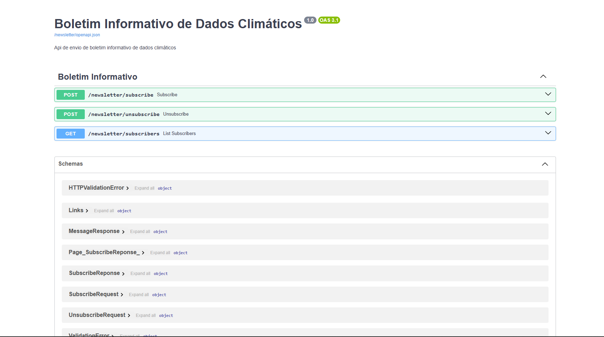

# Newsletter Service

API para coletar dados climáticos de uma localização geográfica.

## Descrição

Esta API permite a subscrição de usuários a newsletter de dados climáticos de uma localização geográfica específica. A API utiliza dados fornecidos pela API do OpenWeather.
A API também envia e-mails para os usuários inscritos com os dados climáticos da localização escolhida.

