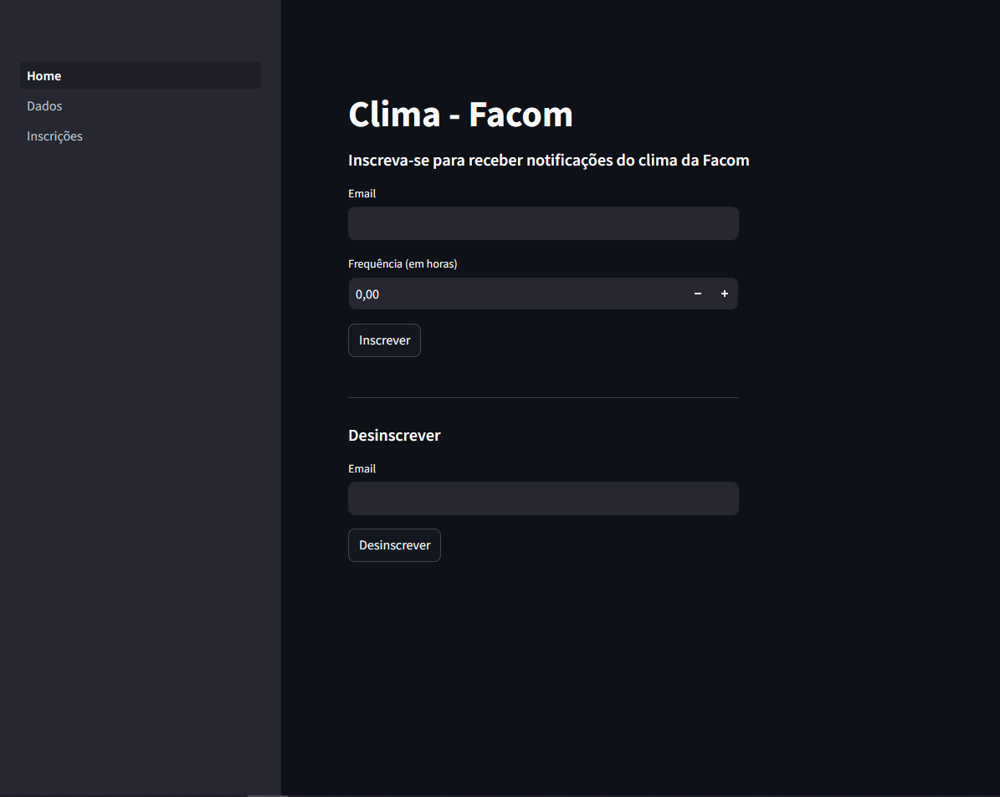
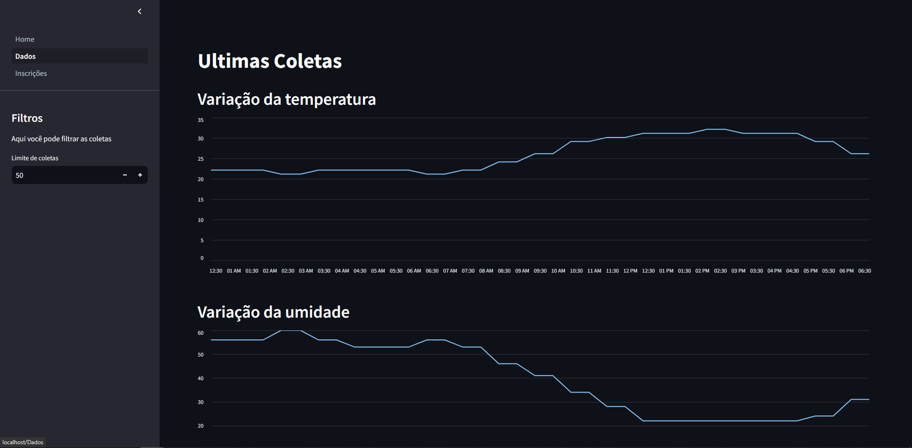
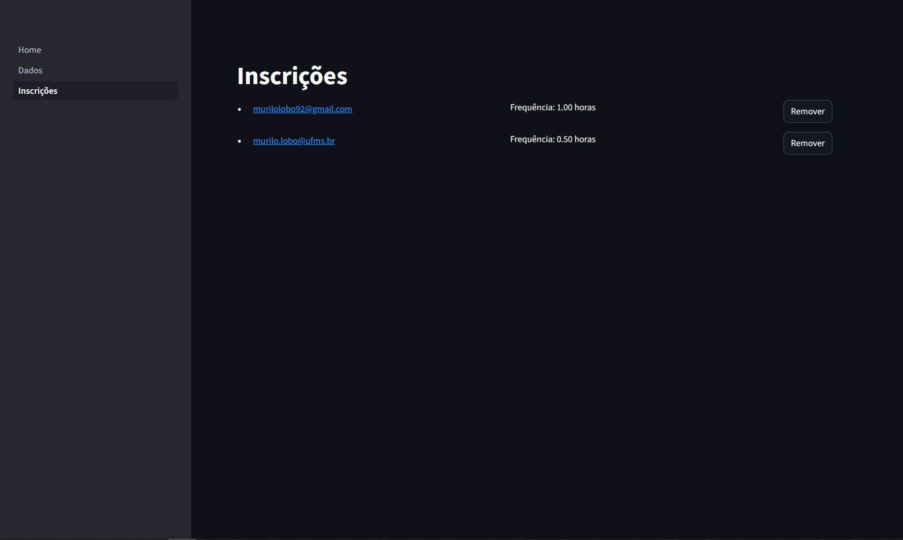

# Web Service

Frontend da aplicação de coleta de dados climáticos.

## Descrição

Este frontend permite a visualização de dados climáticos coletados pela API Coletora de Dados Climáticos, e a inscrição na newsletter de dados climáticos.

